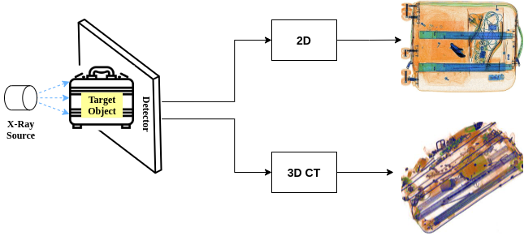

# Brief history of X-ray security imaging in Computer Vision

  

*[List of datasets and papers (not exhaustive)]*
## :card_file_box: Dataset

|Name       | Type | Year | Class |Prohibited - Negative| Annotations| Views|Open Source | 
|-----------|------|------|-------------|-------------|------|-----|------|
|deei6       |2D    | 2021 |6            |7,022 - 0 | bbox, mask|2     |✕ [[Link]](https://breckon.org/toby/publications/papers/bhowmik21energy.pdf)  |
|PIDray    |2D    | 2021 |12           |47,677 - 0  | bbox, mask |1     |✓ [[Link]](https://github.com/bywang2018/security-dataset)       |
|AB       |2D    | 2021 |--            |417 - 6,608 | -- |2     |✕ [[Link]](https://ieeexplore.ieee.org/document/9534034)  |
|dbf4       |2D    | 2020 |4            |10,112 - 0 | bbox, mask |4     |✕ [[Link]](https://breckon.org/toby/publications/papers/isaac20multiview.pdf)  |
|OPIXray    |2D    | 2020 |5            |8,885  - 0 | bbox |1     |✓  [[Link]](https://github.com/OPIXray-author/OPIXray)           |
|SIXray     |2D    | 2019 |6            |8,929 - 1,050,0302 | bbox |1 |✓ [[Link]](https://github.com/MeioJane/SIXray)           |
|COMPASS-XP     |2D    | 2019 |366            |1928 - 0 | -- |1 |✓ [[Link]](https://zenodo.org/record/2654887#.YUtGVHVKikA)           |
|dbf6       |2D    | 2018 |6            |11,627 - 0 | bbox, mask |4    |✕ [[Link]](https://breckon.org/toby/publications/papers/akcay18architectures.pdf)  |
|GDXray       |2D    | 2015 |5            |19,407 - 0 | bbox |1     |✓ [[Link]](https://domingomery.ing.puc.cl/material/gdxray/)  |
|Dur_3D       |3D    | 2020 |5            |774 - 0 | bbox | --   |✕ [[Link]](https://arxiv.org/abs/2008.01218)  |
|Flitton_3D       |3D    | 2015 |2        |810 - 2149 | bbox | --   |✕ [[Link]](https://breckon.org/toby/publications/papers/flitton15codebooks.pdf)  |

---
## :scroll: Paper 
### 2021
#### 2D

- Operationalizing Convolutional Neural Network Architectures for Prohibited Object Detection in X-Ray Imagery [[Link]](https://arxiv.org/abs/2110.04906)
- Towards Automatic Threat Detection: A Survey of Advances of Deep Learning within X-ray Security Imaging  [[Link]](https://arxiv.org/abs/2001.01293)
- On the Impact of Using X-Ray Energy Response Imagery for Object Detection via Convolutional Neural Networks [[Link]](https://arxiv.org/abs/2108.12505)
- Towards Real-World Prohibited Item Detection: A Large-Scale X-ray Benchmark [[Link]](https://arxiv.org/pdf/2108.07020.pdf)
- PANDA: Perceptually Aware Neural Detection of Anomalies [[Link]](https://arxiv.org/abs/2104.13702)
- Tensor Pooling Driven Instance Segmentation Framework for Baggage Threat Recognition [[Link]](https://arxiv.org/abs/2108.09603)
- Unsupervised Anomaly Instance Segmentation for Baggage Threat Recognition [[Link]](https://arxiv.org/abs/2107.07333) 
- Symmetric Triangle Network for Object Detection Within X-ray Baggage Security Imagery [[Link]](https://ieeexplore.ieee.org/document/9533991)
- Anomaly Detection in X-ray Security Imaging: a Tensor-Based Learning Approach [[Link]](https://ieeexplore.ieee.org/document/9534034) 
- Automated Threat Objects Detection with Synthetic Data for Real-Time X-ray Baggage Inspection [[Link]](https://ieeexplore.ieee.org/document/9533928)
- Evaluating GAN-Based Image Augmentation for Threat Detection in Large-Scale Xray Security Images [[Link]](https://www.mdpi.com/2076-3417/11/1/36)

#### 3D CT

- Contraband Materials Detection Within Volumetric 3D Computed Tomography Baggage Security Screening Imagery [[Link]](https://arxiv.org/abs/2012.11753)
- On the Evaluation of Semi-Supervised 2D Segmentation for Volumetric 3D Computed Tomography Baggage Security Screening [[Link]](https://breckon.org/toby/publications/papers/wang21segmentation.pdf)

### 2020
#### 2D
- Multi-view Object Detection Using Epipolar Constraints within Cluttered X-ray Security Imagery [[Link]](https://breckon.org/toby/publications/papers/isaac20multiview.pdf)
- Occluded Prohibited Items Detection: an X-ray Security Inspection Benchmark and De-occlusion Attention Module [[Link]](https://arxiv.org/abs/2004.08656)
- Trainable Structure Tensors for Autonomous Baggage Threat Detection Under Extreme Occlusion [[Link]](https://arxiv.org/abs/2009.13158)
- Cascaded Structure Tensor Framework for Robust Identification of Heavily Occluded Baggage Items from X-ray Scans [[Link]](https://arxiv.org/abs/2004.06780)
- Automatic Threat Detection in Baggage Security Imagery using Deep Learning Models [[Link]](https://ieeexplore.ieee.org/document/9342691)
- Automatic Threat Detection in Single, Stereo (Two) and Multi View X-Ray Images [[Link]](https://ieeexplore.ieee.org/document/9342253)
- Detecting Prohibited Items in X-Ray Images: a Contour Proposal Learning Approach [[Link]](https://ieeexplore.ieee.org/document/9190711)
- Background Adaptive Faster R-CNN for Semi-Supervised Convolutional Object Detection of Threats in X-Ray Images [[Link]](https://arxiv.org/abs/2010.01202)
- X-Ray Baggage Inspection With Computer Vision: A Survey [[Link]](https://ieeexplore.ieee.org/document/9162101)
- Data Augmentation of X-Ray Images in Baggage Inspection Based on Generative Adversarial Networks [[Link]](https://ieeexplore.ieee.org/document/9087880)

#### 3D CT
- Multi-Class 3D Object Detection Within Volumetric 3D Computed Tomography Baggage Security Screening Imagery [[Link]](https://arxiv.org/abs/2008.01218)
- On the Evaluation of Prohibited Item Classification and Detection in Volumetric 3D Computed Tomography Baggage Security Screening Imagery [[Link]](https://arxiv.org/abs/2003.12625)
- A Reference Architecture for Plausible Threat Image Projection (TIP) Within 3D X-ray Computed Tomography Volumes [[Link]](https://arxiv.org/abs/2001.05459)
- An Approach for Adaptive Automatic Threat Recognition Within 3D Computed Tomography Images for Baggage Security Screening [[Link]](https://arxiv.org/abs/1903.10604)

### 2019
#### 2D
- Evaluating the Transferability and Adversarial Discrimination of Convolutional Neural Networks for Threat Object Detection and Classification within X-Ray Security Imagery [[Link]](https://arxiv.org/abs/1911.08966)
- On the Impact of Object and Sub-Component Level Segmentation Strategies for Supervised Anomaly Detection within X-Ray Security Imagery [[Link]](https://arxiv.org/abs/1911.08216)
- Using Deep Neural Networks to Address the Evolving Challenges of Concealed Threat Detection within Complex Electronic Items [[Link]](https://breckon.org/toby/publications/papers/bhowmik19electronics.pdf)
- On the Use of Deep Learning for the Detection of Firearms in X-ray Baggage Security Imagery [[Link]](https://breckon.org/toby/publications/papers/gaus19firearms.pdf)
- The Good, the Bad and the Ugly: Evaluating Convolutional Neural Networks for Prohibited Item Detection Using Real and Synthetically Composite X-ray Imagery [[Link]](https://arxiv.org/abs/1909.11508)
- Evaluating a Dual Convolutional Neural Network Architecture for Object-wise Anomaly Detection in Cluttered X-ray Security Imagery [[Link]](https://breckon.org/toby/publications/papers/gaus19anomaly.pdf)
- Skip-GANomaly: Skip Connected and Adversarially Trained Encoder-Decoder Anomaly Detection [[Link]](https://arxiv.org/abs/1901.08954)
- An evaluation of deep learning based object detection strategies for threat object detection in baggage security imagery [[Link]](https://www.sciencedirect.com/science/article/pii/S016786551930011X)
- Deep Convolutional Neural Network Based Object Detector for X-Ray Baggage Security Imagery [[Link]](https://ieeexplore.ieee.org/abstract/document/8995335)
- Automated firearms detection in cargo x-ray images using RetinaNet [[Link]](https://www.spiedigitallibrary.org/conference-proceedings-of-spie/10999/109990P/Automated-firearms-detection-in-cargo-x-ray-images-using-RetinaNet/10.1117/12.2517817.full?SSO=1)
- Toward Automatic Threat Recognition for Airport X-ray Baggage Screening with Deep Convolutional Object Detection [[Link]](https://arxiv.org/abs/1912.06329)
- “Unexpected Item in the Bagging Area”: Anomaly Detection in X-Ray Security Images [[Link]](https://ieeexplore.ieee.org/document/8537982)
- Limits on transfer learning from photographic image data to X-ray threat detection [[Link]](https://www.semanticscholar.org/paper/Limits-on-transfer-learning-from-photographic-image-Caldwell-Griffin/7e7e445bbb757c4ec9165505925e48b0f94a92ad)
- Data Augmentation for X-Ray Prohibited Item Images Using Generative Adversarial Networks [[Link]](https://ieeexplore.ieee.org/document/8654640)
- Modified Adaptive Implicit Shape Model for Object Detection [[Link]](https://link.springer.com/chapter/10.1007/978-3-030-36802-9_17)
- Graph clustering and variational image segmentation for automated firearm detection in X-ray images [[Link]](https://digital-library.theiet.org/content/journals/10.1049/iet-ipr.2018.5198)
- Semantic Segmentation for Prohibited Items in Baggage Inspection [[Link]](https://link.springer.com/chapter/10.1007/978-3-030-36189-1_41#:~:text=Semantic%20segmentation%20is%20a%20branch,open%20the%20baggage%20for%20inspection.)
- Application of Machine Learning Methods for Material Classification with Multi-energy X-Ray Transmission Images [[Link]](https://link.springer.com/chapter/10.1007/978-3-030-24274-9_17)
- Handgun Detection in Single-Spectrum Multiple X-ray Views Based on 3D Object Recognition [[Link]](https://link.springer.com/article/10.1007/s10921-019-0602-9)

#### 3D CT
- On the Relevance of Denoising and Artefact Reduction in 3D Segmentation and Classification within Complex Computed Tomography Imagery [[Link]](https://breckon.org/toby/publications/papers/mouton19relevance.pdf)

### 2018

#### 2D
- On Using Deep Convolutional Neural Network Architectures for Automated Object Detection and Classification within X-ray Baggage Security Imagery [[Link]](https://breckon.org/toby/publications/papers/akcay18architectures.pdf)
- GANomaly: Semi-Supervised Anomaly Detection via Adversarial Training [[Link]](https://arxiv.org/abs/1805.06725)
- Multi-view X-ray R-CNN [[Link]](https://arxiv.org/abs/1810.02344)
- A GAN-Based Image Generation Method for X-Ray Security Prohibited Items [[Link]](https://link.springer.com/chapter/10.1007/978-3-030-03398-9_36)
- Prohibited Item Detection in Airport X-Ray Security Images via Attention Mechanism Based CNN [[Link]](https://link.springer.com/chapter/10.1007/978-3-030-03335-4_37)
- Convolutional Neural Networks for Automatic Threat Detection in Security X-Ray Images [[Link]](https://ieeexplore.ieee.org/document/8614074)
- Automatic threat recognition of prohibited items at aviation checkpoint with x-ray imaging: a deep learning approach [[Link]](https://www.spiedigitallibrary.org/conference-proceedings-of-spie/10632/1063203/Automatic-threat-recognition-of-prohibited-items-at-aviation-checkpoint-with/10.1117/12.2309484.full?webSyncID=8531ab0d-3a6b-03c9-7c00-9b6bcd746b80&sessionGUID=d8e8abee-aed6-ae05-c117-aac5a9199362)

#### 3D CT
- Consensus relaxation on materials of interest for adaptive ATR in CT images of baggage [[Link]](https://www.spiedigitallibrary.org/conference-proceedings-of-spie/10632/106320E/Consensus-relaxation-on-materials-of-interest-for-adaptive-ATR-in/10.1117/12.2309839.full)

### Earlier

#### 2D
- An Evaluation Of Region Based Object Detection Strategies Within X-Ray Baggage Security Imagery [[Link]](https://breckon.org/toby/publications/papers/akcay17region.pdf)
- On using Feature Descriptors as Visual Words for Object Detection within X-ray Baggage Security Screening [[Link]](https://breckon.org/toby/publications/papers/kundegorski16xray.pdf)
- Transfer Learning Using Convolutional Neural Networks For Object Classification Within X-Ray Baggage Security Imagery [[Link]](https://breckon.org/toby/publications/papers/akcay16transfer.pdf)
- Improving Feature-based Object Recognition for X-ray Baggage Security Screening using Primed Visual Words [[Link]](https://breckon.org/toby/publications/papers/turcsany13xray.pdf)
- A Combinational Approach to the Fusion, De-noising and Enhancement of Dual-Energy X-Ray Luggage Images [[Link]](https://ieeexplore.ieee.org/document/1565297)
- Improving Weapon Detection In Single Energy X-ray Images Through Pseudocoloring [[Link]](https://ieeexplore.ieee.org/abstract/document/1715507)
- A review of X-ray explosives detection techniques for checked baggage [[Link]](https://www.sciencedirect.com/science/article/pii/S0969804312000127)
- A Logarithmic X-Ray Imaging Model for Baggage Inspection: Simulation and Object Detection [[Link]](https://ieeexplore.ieee.org/document/8014771)
- Automatic Defect Recognition in X-Ray Testing Using Computer Vision [[Link]](https://ieeexplore.ieee.org/document/7926702)
- Modern Computer Vision Techniques for X-Ray Testing in Baggage Inspection[[Link]](https://ieeexplore.ieee.org/document/7775025)
- Inspection of Complex Objects Using Multiple-X-Ray Views [[Link]](https://ieeexplore.ieee.org/document/6782468)
- Automated X-Ray Object Recognition Using an Efficient Search Algorithm in Multiple Views [[Link]](https://ieeexplore.ieee.org/document/6595901)
- X-Ray Testing by Computer Vision [[Link]](https://ieeexplore.ieee.org/document/6595900)
- Automated detection in complex objects using a tracking algorithm in multiple X-ray views [[Link]](https://ieeexplore.ieee.org/document/5981715)
- Threat Objects Detection in X-ray Images Using an Active Vision Approach [[Link]](https://link.springer.com/article/10.1007/s10921-017-0419-3)
- Object recognition in X-ray testing using an efficient search algorithm in multiple views [[Link]](https://www.ingentaconnect.com/content/bindt/insight/2017/00000059/00000002/art00008;jsessionid=1n6a28jhds21c.x-ic-live-02)
- Modern Computer Vision Techniques for X-Ray Testing in Baggage Inspection [[Link]](https://ieeexplore.ieee.org/document/7775025)
- Automated Detection of Threat Objects Using Adapted Implicit Shape Model [[Link]](https://ieeexplore.ieee.org/document/7123190)

#### 3D CT
- Geometrical Approach for the Automatic Detection of Liquid Surfaces in 3D Computed Tomography Baggage Imagery [[Link]](https://breckon.org/toby/publications/papers/chermak15liquids.pdf)
- Materials-Based 3D Segmentation of Unknown Objects from Dual-Energy Computed Tomography Imagery in Baggage Security Screening [[Link]](https://breckon.org/toby/publications/papers/mouton15segmentation.pdf)
- Object Classification in 3D Baggage Security Computed Tomography Imagery using Visual Codebooks [[Link]](https://breckon.org/toby/publications/papers/flitton15codebooks.pdf)
- 3D Object Classification in Baggage Computed Tomography Imagery using Randomised Clustering Forests [[Link]](https://breckon.org/toby/publications/papers/mouton14randomised.pdf)
- Investigating Existing Medical CT Segmentation Techniques within Automated Baggage and Package Inspection [[Link]](https://breckon.org/toby/publications/papers/megherbi13segmentation.pdf)
- Radon Transform based Metal Artefacts Generation in 3D Threat Image Projection [[Link]](https://breckon.org/toby/publications/papers/megherbi13radon.pdf)
- A Comparison of 3D Interest Point Descriptors with Application to Airport Baggage Object Detection in Complex CT Imagery [[Link]](https://breckon.org/toby/publications/papers/flitton13interestpoint.pdf)
- A Distance Weighted Method for Metal Artefact Reduction in CT [[Link]](https://breckon.org/toby/publications/papers/mouton13mar.pdf)
- An Experimental Survey of Metal Artefact Reduction in Computed Tomography [[Link]](https://breckon.org/toby/publications/papers/mouton13survey.pdf)
- An Evaluation of CT Image Denoising Techniques Applied to Baggage Imagery Screening [[Link]](https://breckon.org/toby/publications/papers/mouton13denoising.pdf)
- Fully Automatic 3D Threat Image Projection: Application to Densely Cluttered 3D Computed Tomography Baggage Images [[Link]](https://breckon.org/toby/publications/papers/megherbi12tip.pdf)
- A Comparison of Classification Approaches for Threat Detection in CT based Baggage Screening [[Link]](https://breckon.org/toby/publications/papers/megherbi12baggage.pdf)
- A Novel Intensity Limiting Approach to Metal Artefact Reduction in 3D CT Baggage Imagery [[Link]](https://breckon.org/toby/publications/papers/mouton12mar.pdf)
- A 3D Extension to Cortex Like Mechanisms for 3D Object Class Recognition [[Link]](https://breckon.org/toby/publications/papers/flitton12cortex.pdf)
- Object Recognition using 3D SIFT in Complex CT Volumes [[Link]](https://breckon.org/toby/publications/papers/flitton10baggage.pdf)
- A Classifier based Approach for the Detection of Potential Threats in CT based Baggage Screening [[Link]](https://breckon.org/toby/publications/papers/megherbi10baggage.pdf)
- A review of automated image understanding within 3D baggage computed tomography security screening [[Link]](https://breckon.org/toby/publications/papers/mouton15review.pdf)